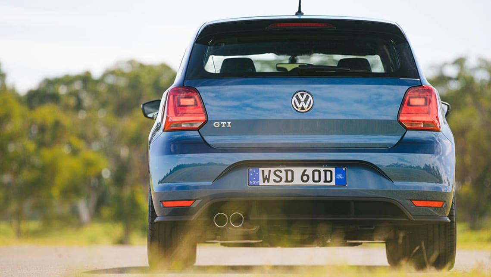
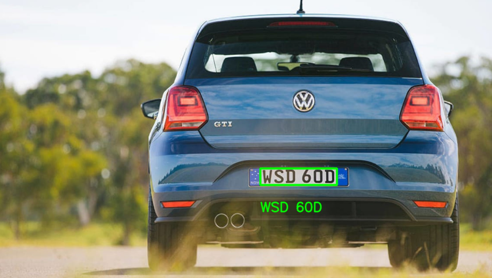
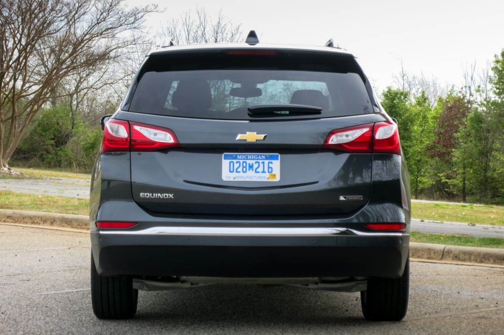
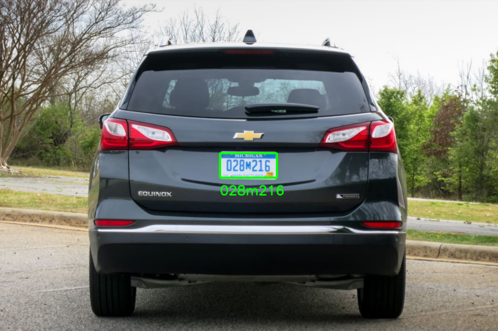
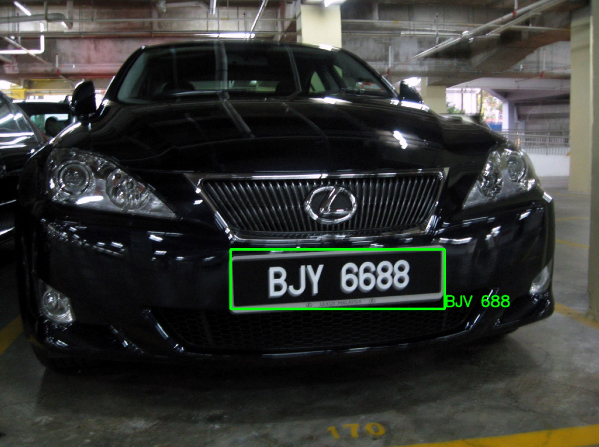

# Automatic Number Plate Recognition
A simple license plate number recognizer/extractor. Based on [Nicholas Renotte's ANPR Tutorial](https://github.com/nicknochnack/ANPRwithPython/blob/main/ANPR%20-%20Tutorial.ipynb)

## Environment
- Anaconda (v4.5.11) => for the virtual environment, can use alternatives
- Ubuntu 18.04 on WSL2

## Requirements
- OpenCV
- GPU for use in PyTorch
- Proper GPU drivers (for NVIDIA, see [here](https://docs.nvidia.com/cuda/wsl-user-guide/index.html#installing-nvidia-drivers))
- (Optional) A dispaly server for running GUI programs designed for the X Window System (e.g. [VcXsrv](https://sourceforge.net/projects/vcxsrv/))

## Dev Environment
- VS Code with [WSL link](https://code.visualstudio.com/docs/remote/wsl-tutorial)

## Installation
For new environemnt
```
conda create --name <env-name> --file requirements.txt
```
or, for existing (hopefully sparse) environments
```
conda install --file requirements.txt
```
That should be it!
### Troubleshooting
If PyTorch complains about GPU compatibility, try the following for RTX 3000 series NVIDIA GPUs: 
```
conda install pytorch torchvision cudatoolkit=11 -c pytorch-nightly
```

## Usage
```
python main.py -i <inputfile>
```
Where `inputfile` is the path to your image.

There are some example images in the `images` directory.

## Results
### Image 0


### Image 1


### Image 2


Needs some improvement...